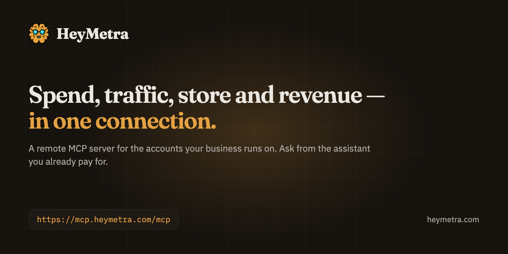

<div align="center">



# HeyMetra

**Manage your business with your AI assistant.**

A remote MCP server for the accounts your business already runs on — ads, analytics, store, CRM, mobile subscriptions. Connect them once, then ask about all of them together from Claude, ChatGPT, Cursor or whichever assistant you already pay for.

[](https://registry.modelcontextprotocol.io/v0/servers?search=heymetra)
[](https://modelcontextprotocol.io/specification/draft/basic/transports)
[](https://heymetra.com/security/)
[](https://heymetra.com/)

```
https://mcp.heymetra.com/mcp
```

</div>

---

## What this is

Most MCP servers cover one vendor. Connect the Google Ads one and it will tell you what you spent; it cannot tell you what you earned, because the money arrived in Stripe, or Shopify, or Adapty, and that is a different server with a different login.

HeyMetra is one server over all of them. Spend, traffic, store and revenue answer the same question at the same time, which is the only way a question like *"did that campaign pay for itself?"* has an answer at all.

Two consequences worth knowing before you read further:

- **The model is yours.** HeyMetra has no chat interface and buys no inference. Your assistant calls our tools using the subscription you already have, which is why a seat costs what it costs.
- **The tool list is yours too.** A workspace sees tools for the accounts it has connected and nothing else. There is no fixed catalogue of 57 tools sitting in your assistant's context — only the ones that can actually answer.

Of those tools, **45 read and 12 write**. Every one of the 12 stops and asks a person first. See [Writes stop for a person](#writes-stop-for-a-person).

## Who it's for

- **Founders and small teams** with no analyst. "How did we do last week?" should not require a dashboard tour.
- **Marketing and growth** with budget split across platforms. "Where are we burning money?" is a cross-account question by definition.
- **Agencies** where every client wants their own report, yesterday.
- **Mobile app owners** — ad spend lives in one place and subscription revenue in another. This is the gap HeyMetra was built around: AppsFlyer, Adapty, RevenueCat and App Store Connect sit beside Google Ads and Meta, on one connection.

Not for you if you want a chat product or a dashboard. HeyMetra is neither, and it is paid — no free plan, no trial. The current plans are on the [pricing page](https://heymetra.com/pricing/).

## Connect it

The address is the same everywhere:

```
https://mcp.heymetra.com/mcp
```

Your assistant will send you through a sign-in once, and HeyMetra never sees a password for any connected account — authorisation happens at the provider.

<details>
<summary><b>Claude</b> — Settings → Customize → Connectors → Add custom connector</summary>

Anthropic calls a connected MCP server a *connector*. Add it from Claude's own settings; on Team and Enterprise plans only an owner can add it, under Organization settings.

Full walkthrough: [heymetra.com/mcp/claude/](https://heymetra.com/mcp/claude/)
</details>

<details>
<summary><b>ChatGPT</b> — Settings → Security and login → Developer mode, then chatgpt.com/plugins</summary>

The endpoint has to include its `/mcp` path here. OpenAI has moved this setting more than once, so if the menu disagrees with this line, trust the menu and tell us.

Full walkthrough: [heymetra.com/mcp/chatgpt/](https://heymetra.com/mcp/chatgpt/)
</details>

<details>
<summary><b>Grok</b> — grok.com/connectors → New Connector → Custom</summary>

xAI calls this "bring your own MCP". It asks for the MCP server URL and nothing else.

Full walkthrough: [heymetra.com/mcp/grok/](https://heymetra.com/mcp/grok/)
</details>

<details>
<summary><b>Perplexity</b> — Settings → Connectors → Custom connector → Remote</summary>

Perplexity documents remote connectors as a Pro, Max and Enterprise feature.

Full walkthrough: [heymetra.com/mcp/perplexity/](https://heymetra.com/mcp/perplexity/)
</details>

<details>
<summary><b>Claude Code</b> — one command</summary>

```bash
claude mcp add --transport http heymetra https://mcp.heymetra.com/mcp
```

Or a `.mcp.json` in the project root. `/mcp` inside a session shows what connected.

Full walkthrough: [heymetra.com/mcp/claude-code/](https://heymetra.com/mcp/claude-code/)
</details>

<details>
<summary><b>Codex</b> — <code>~/.codex/config.toml</code></summary>

```toml
[mcp_servers.heymetra]
url = "https://mcp.heymetra.com/mcp"
```

Then `codex mcp login`.

Full walkthrough: [heymetra.com/mcp/codex/](https://heymetra.com/mcp/codex/)
</details>

<details>
<summary><b>Cursor</b> — <code>~/.cursor/mcp.json</code>, or <code>.cursor/mcp.json</code> in a project</summary>

```json
{
  "mcpServers": {
    "heymetra": { "url": "https://mcp.heymetra.com/mcp" }
  }
}
```

Leave the static OAuth fields empty — they exist for servers that cannot register themselves, and this one can.

Full walkthrough: [heymetra.com/mcp/cursor/](https://heymetra.com/mcp/cursor/)
</details>

<details>
<summary><b>Antigravity</b> — <code>~/.gemini/config/mcp_config.json</code>, or <code>.agents/mcp_config.json</code> in a project</summary>

```json
{
  "mcpServers": {
    "heymetra": { "serverUrl": "https://mcp.heymetra.com/mcp" }
  }
}
```

The key is `serverUrl`, not `url` — the one thing Antigravity spells differently from every other JSON client.

Full walkthrough: [heymetra.com/mcp/antigravity/](https://heymetra.com/mcp/antigravity/)
</details>

New to any of this? [What an MCP server is, and how it differs from an API](https://heymetra.com/mcp/).

## What you can ask

Questions that need two accounts at once are the point:

> Which channel actually paid for itself last month — spend against subscription revenue, not installs?

> Search Console clicks fell last week. Which queries lost them, and did orders move with them?

> Compare cost per trial across platforms for the last 28 days.

> Which leads in the CRM came from the campaign that started on Monday?

> Cut the budget on the ad set with the worst cost per purchase by 20%.

The last one does not run. It comes back as a change for you to approve.

## Writes stop for a person

A tool that would change an account returns the proposed change instead of executing it. You approve it, and the payload you approved is the payload that runs — the model does not get to reconsider after the fact.

The bounds are values in code, not instructions in a prompt:

| Bound | Value |
|---|---|
| Budget change in one action | ±50% |
| Absolute budget ceiling | 10,000 in the account's currency |
| Campaigns touched by one action | 5 |
| Account-changing writes per rolling day | 20 |
| Messages sent per rolling day | 20, counted separately |
| Approval expires after | 30 minutes |

The last one matters more than it looks: an approval card left open overnight is a decision made against yesterday's numbers.

What HeyMetra does not claim: no SOC 2, no ISO certification, no penetration test. [The security page](https://heymetra.com/security/) says so in those words, along with what is actually in place.

## Connectors

Every connector in the catalogue, by category. **Which of these you can connect today is on each connector's own page** — that list moves, and a README is the wrong place to freeze it.

**Ads** — [Google Ads](https://heymetra.com/connectors/google-ads/) · [Meta](https://heymetra.com/connectors/meta-ads/)

**Analytics** — [Google Analytics 4](https://heymetra.com/connectors/google-analytics-4/) · [Google Search Console](https://heymetra.com/connectors/google-search-console/)

**Ecommerce** — [Shopify](https://heymetra.com/connectors/shopify/) · [Trendyol](https://heymetra.com/connectors/trendyol/) · [WooCommerce](https://heymetra.com/connectors/woocommerce/)

**Revenue & CRM** — [Stripe](https://heymetra.com/connectors/stripe/) · [HubSpot](https://heymetra.com/connectors/hubspot/) · [Zoho CRM](https://heymetra.com/connectors/zoho-crm/) · [Zoho SalesIQ](https://heymetra.com/connectors/zoho-salesiq/) · [Zoho Marketing Automation](https://heymetra.com/connectors/zoho-marketing-automation/)

**Mobile** — [AppsFlyer](https://heymetra.com/connectors/appsflyer/) · [RevenueCat](https://heymetra.com/connectors/revenuecat/) · [Adapty](https://heymetra.com/connectors/adapty/) · [App Store Connect](https://heymetra.com/connectors/app-store-connect/)

**Channels** (delivery, not data) — [Slack](https://heymetra.com/connectors/slack/) · [Telegram](https://heymetra.com/connectors/telegram/) · [Email](https://heymetra.com/connectors/email/)

Missing one you need? Ask inside the assistant — `submit_feedback` sends the request to us in your own words — or [write to us](https://heymetra.com/contact/).

## How it works

- **Transport** — Streamable HTTP. SSE is not offered.
- **Authorisation** — OAuth 2.1. The server publishes an RFC 9728 protected-resource document, so a client discovers where to sign in rather than being told. Nothing is pasted into a config file except the address above.
- **Per-workspace surface** — tools are resolved per request from the accounts that workspace has connected. A revoked token stops working on the next call, not whenever the transport session happens to end.
- **Change notifications** — connect an account mid-conversation and the tool list updates in place.

Published in the [Official MCP Registry](https://registry.modelcontextprotocol.io/v0/servers?search=heymetra) as `com.heymetra/heymetra`.

## Links

| | |
|---|---|
| Product | [heymetra.com](https://heymetra.com/) |
| Pricing | [heymetra.com/pricing/](https://heymetra.com/pricing/) |
| Connectors | [heymetra.com/connectors/](https://heymetra.com/connectors/) |
| Setup per assistant | [heymetra.com/mcp/](https://heymetra.com/mcp/) |
| Security and limits | [heymetra.com/security/](https://heymetra.com/security/) |
| Comparisons | [heymetra.com/compare/](https://heymetra.com/compare/) |
| MCP server directory | [heymetra.com/mcp/directory/](https://heymetra.com/mcp/directory/) |
| Writing | [heymetra.com/blog/](https://heymetra.com/blog/) |
| About | [heymetra.com/about/](https://heymetra.com/about/) |
| Contact | [hello@heymetra.com](mailto:hello@heymetra.com) |

This repository is documentation. HeyMetra itself is a hosted service and its source is not public; there is nothing to install or run from here. Corrections and questions are welcome as [issues](https://github.com/zeisoft/heymetra-mcp/issues) — a wrong setup line is worth reporting, because the reader follows it, fails, and concludes the product is broken.

<div align="center">
<sub>Built by <a href="https://zeisoft.com">Zeisoft Yazılım Limited Şirketi</a> — İzmir, Türkiye</sub>
</div>
